# Infra Optimization - Fixing EasyPay

Capstone Project for PGP DevOps

By Nyukeit

## Details & Context Statement

A popular payment application, **EasyPay** where users add money to their wallet accounts, faces an issue in its payment success rate. The timeout that occurs with the connectivity of the database has been the reason for the issue. 

While troubleshooting, it is found that the database server has several downtime instances at irregular intervals. This situation compels the company to create their own infrastructure that runs in high-availability mode (at application level).

Given that online shopping experiences continue to evolve as per customer expectations, the developers are driven to make their app more reliable, fast, and secure for improving the performance of the current system.

> Disclaimer: Despite being mentioned that there is sample code for the project to download from the portal, there is none, so we will be implementing a simple Hello World Java App instead.

### Implementation Requirements

1. Create the cluster (EC2 instances with load balancer and elastic IP in case of AWS)
2. Automate the provisioning of an EC2 instance using Ansible or Chef Puppet
3. Install Docker and Kubernetes on the cluster
4. Implement the network policies at the database pod to allow ingress traffic from the front-end application pod
5. Create a new user with permissions to create, list, get, update, and delete pods
6. Configure application on the pod
7. Take snapshot of ETCD database
8. Set criteria such that if the memory of CPU goes beyond 50%, environments automatically get scaled up and configured

### Tool Requirements

| AWS EC2                                                      | Docker                                                       | Kubernetes                                                   | Ansible                                                      | Terraform                                                    |
| ------------------------------------------------------------ | ------------------------------------------------------------ | ------------------------------------------------------------ | ------------------------------------------------------------ | ------------------------------------------------------------ |
|  |  |  |  |  |
| Deployed                                                     | Cloud                                                        | Cloud                                                        | Local                                                        | Local                                                        |

### Final Setup Architecture Diagram

The basic idea here is to make our application accessible from the internet using an ElasticIP, Elastic Load Balancer and then routing traffic to our Kubernetes Cluster. Here is a diagram from AWS that shows how this will work.


> Note: This diagram shows the flow of traffic in two different availability zones but for the sake of this project, we will be working within a single availability zone. This is because the output of the project is only to Autoscale a cluster **Horizontally**. This is not a best practice for High Availability in production environments.  

####  Repository  

https://github.com/nyukeit/fixing-infra-op

## Step 1 - Create AWS Resources (Part 1)

In this step, we will provision the various AWS resources required for the implementation of our application. These will include EC2 3-node cluster (read more here on why you need a minimum of 3 nodes for high-availability), a Load Balancer and an Elastic IP to access our application from outside.

> Note: In Part 1, we will leave out the LB and EIP to keep the installation and setup simple. They will be provisioned later in Part 2.

To keep things extremely simple and straightforward, we will deploy 3 **similar** EC2 instances using the count meta argument. We will output the IPs of these newly created instances and populate our Ansible hosts inventory dynamically using these.

### 1.1 Create Keypair in EC2 Dashboard

First, create a keypair from the AWS EC2 dashboard. While you can create this in Terraform too, they discourage this method and suggest us to create a keypair outside of Terraform. Steps to create this can be followed [here](https://dev.to/nyukeit/provisioning-an-ec2-instance-using-terraform-keypair-1b9k).

Amazon allows us to use a single keypair for multiple EC2 instances.

### 1.2 Creating Variables

> Note: All these variables are in a single TF file. They are presented here in pieces for better understanding.

[Variables Complete File](https://github.com/nyukeit/fixing-infra-op/blob/main/tf-modules/variables.tf)

#### 1.2.1 AMI ID

Although you can dynamically fetch the `ami_id` using data sources, we will just manually mention it here because we are deploying the same Ubuntu instance and we do not need any changes in that.

```
variable "ami_id" {
    default = "ami-08fdec01f5df9998f" 
}
```

#### 1.2.2 AWS Credentials

Apart from that, we will need the AWS access credentials for our account as well as the region in which the resources will be deployed. 

```
variable "aws_access_key" {
    default = "..."
}
variable "aws_secret_key" {
default = "..."
}
variable "aws_token" {
  default = "..."
}
```

#### 1.2.3 AWS Region

```
variable "region" {
    default = "us-east-1"
}
```

Mentioning this region makes sure all of our resources are created within this region. The region is selected based on multiple criteria that should fit your needs. Here is a brief on this.

#### 1.2.4 SSH User

The `ssh_user` is hardcoded as `ubuntu` because all of the EC2 Ubuntu instances have the user as this.

```
variable "ssh_user" {
  default = "ubuntu"
}
```

#### 1.2.5 Key Name

The key name must be the same as what we created in the EC2 dashboard.

```
variable "key_name" {
    default = "infra_op"
}
```

### 1.3 Main Terraform File

Let's create a TF script that will deploy the instances. For the sake of clarity and understanding, we will divide it in smaller modules here. The full file is available on the GH repository.

[Full Terraform Main File](https://github.com/nyukeit/fixing-infra-op/blob/main/tf-modules/main.tf)

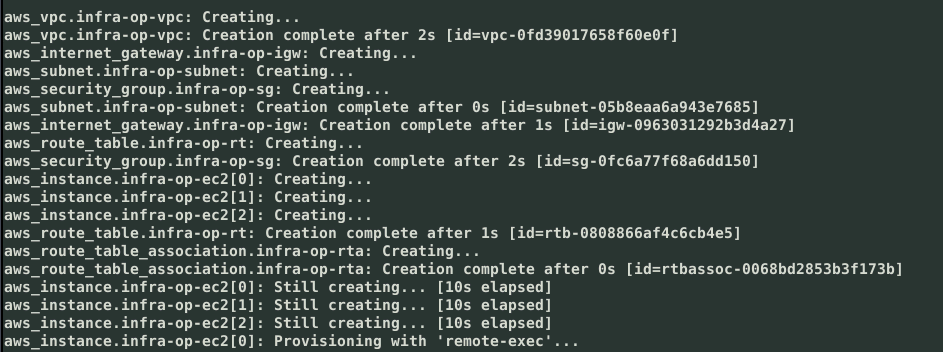

#### 1.3.1 Providers

The intro into a Terraform file is always the providers section. You can also commission this as a separate file. 

```
terraform{
required_version = ">= 1.0"
  required_providers {
    aws = {
      source = "hashicorp/aws"
    }
  }
}

provider "aws" {
  region = "${var.region}"
  access_key = "${var.aws_access_key}"
  secret_key = "${var.aws_secret_key}"
  token = "${var.aws_token}"
}
```

#### 1.3.2 Local Variables

After declaring the providers, we will define local variables for using in the current terraform script. Local variables do not work across modules.

```
# Define Local Variables
locals {
  private_key_path = "${var.key_name}.pem"
}
```

The private key that will be used to login in to our EC2 instances. Note that we are only providing a key name. This is because the key itself is present in the same folder. If your key is in another folder, make sure to provide the full path.

#### 1.3.3 Network

In this part, we are defining the network which will allow us to access our EC2 instances from the outside. The bare minimum elements of AWS to get this working are deployed here.

```
resource "aws_vpc" "infra-op-vpc" {
  cidr_block = "10.0.0.0/24"

  tags = {
    Name = "Infra OP VPC"
  }
}

resource "aws_subnet" "infra-op-subnet" {
  vpc_id = aws_vpc.infra-op-vpc.id
  cidr_block = "10.0.0.0/24"
  availability_zone = "us-east-1a"

  tags = {
    Name = "Infra OP Subnet"
  }
}

resource "aws_internet_gateway" "infra-op-igw" {
  vpc_id = aws_vpc.infra-op-vpc.id

  tags = {
    Name = "Infra OP IGW"
  }
}

resource "aws_route_table" "infra-op-rt" {
  vpc_id = aws_vpc.infra-op-vpc.id

  route {
    cidr_block = "0.0.0.0/0"
    gateway_id = aws_internet_gateway.infra-op-igw.id
  }

  tags = {
    Name = "Infra OP RT"
  }
}

resource "aws_route_table_association" "infra-op-rta" {
  subnet_id = aws_subnet.infra-op-subnet.id
  route_table_id = aws_route_table.infra-op-rt.id
}
```

**Important** - Without the Route Table Association, you will not be able to access or SSH into the instances.

#### 1.3.4 Security Group

The Security Group will lay down the access rules to our instances. Ideally, we do not want to open all the ports of our instances for access. We are only allowing access to ports that are needed by SSH, HTTP and Kubernetes specific ports.

```
resource "aws_security_group" "infra-op-sg" {
  name = "infra-op-sg"
  vpc_id = aws_vpc.infra-op-vpc.id
  
  ingress {
    from_port = 80
    to_port = 80
    protocol = "tcp"
    cidr_blocks = ["0.0.0.0/0"]
  }
  
  # Port for Kube API Server
  ingress {
    from_port = 6443
    to_port = 6443
    protocol = "tcp"
    cidr_blocks = ["0.0.0.0/0"]
  }

  # Port for Kubelet API
  ingress {
    from_port = 10250
    to_port = 10250
    protocol = "tcp"
    cidr_blocks = ["0.0.0.0/0"]
  }

  # Port for Kube Controller Manager
  ingress {
    from_port = 10257
    to_port = 10257
    protocol = "tcp"
    cidr_blocks = ["0.0.0.0/0"]
  }

  # Port for Kube Scheduler
  ingress {
    from_port = 10259
    to_port = 10259
    protocol = "tcp"
    cidr_blocks = ["0.0.0.0/0"]
  }

  # Ports for NodePort Service
  ingress {
    from_port = 30000
    to_port = 32767
    protocol = "tcp"
    cidr_blocks = ["0.0.0.0/0"]
  }

  # Ports for ETCD
  ingress {
    from_port = 2379
    to_port = 2380
    protocol = "tcp"
    cidr_blocks = ["0.0.0.0/0"]
  }

  ingress {
    from_port = 8080
    to_port = 8080
    protocol = "tcp"
    cidr_blocks = ["0.0.0.0/0"]
  }

  # This will allow us to SSH into the instance for Ansible to do it's magic.
  ingress {
    from_port = 22
    to_port = 22
    protocol = "tcp"
    cidr_blocks = ["0.0.0.0/0"]
  }

  egress {
    from_port = 0
    to_port = 0
    protocol = "-1"
    cidr_blocks = ["0.0.0.0/0"]
  }
}
```

#### 1.3.5 EC2 Instances

As we mentioned earlier, we need 3 similar instances for the purpose of our outcome. We will use the `count` function in Terraform to write the requirements once, but to provision 3 instances in one go.

> Note: We are deploying these instances in the same subnet for the sake of this project. This is not best practice in production environments for High Availability.

```
resource "aws_instance" "infra-op-ec2" {
  count = 3
  ami = "${var.ami_id}"
  instance_type = "t3.micro"
  associate_public_ip_address = true
  vpc_security_group_ids = [aws_security_group.infra-op-sg.id]
  key_name = "${var.key_name}"
  subnet_id = aws_subnet.infra-op-subnet.id

  connection {
    type = "ssh"
    host = self.public_ip
    user = "${var.ssh_user}"
    private_key = file(local.private_key_path)
    timeout = "10m"
  }

   provisioner "remote-exec" {
    inline = ["echo 'connected!'"]
  }
}
```

We are also making a connection to the instances after provisioning them using a `remote-exec` provisioner. This is because the instances will usually take a while to be ready to accept connections.

This provisioner has the ability to wait and retry till the connections are established. If we don't do this, our Ansible executions may fail in case the instances are not yet connection-ready.

## Step 2 Install and Setup

This Terraform code will invoke Ansible playbooks to install Docker, CRI-Docker, Kubectl, Kubeadm and Kubelet. The full Ansible Playbooks are available in the repository.

### 2.1 Hosts File

Terraform will create an Ansible inventory dynamically using the attributes exported from the creation of the EC2 instances. We are specifically interested in the **Public IPs** of our instances for this purpose.

```
# Creating a local hosts file for local Ansible to use
resource "local_file" "hosts" {
  content = <<-DOC
    #  Generated by Terraform
    [master]
    ${aws_instance.infra-op-ec2[0].public_ip}
    
    [workers]
    ${aws_instance.infra-op-ec2[1].public_ip}
    ${aws_instance.infra-op-ec2[2].public_ip}

    [all:vars]
    ansible_user="${var.ssh_user}"
    ansible_ssh_private_key_path="/tf-modules/${local.private_key_path}"
    ansible_ssh_common_args="-o StrictHostKeyChecking=no"
    DOC
  filename = "${path.module}/hosts"
}
```

### 2.2 Installing Apps

We are using a `local-exec` provisioner on the newly created Ansible inventory to run a playbook which will install and setup all the required software on the EC2 instances.

[Installing Apps Playbook](https://github.com/nyukeit/fixing-infra-op/blob/main/playbooks/kube-deps.yaml)

```
# Using Local Exec to install apps on our instance using Local Ansible
resource "null_resource" "install_apps" {
  depends_on = [
    aws_instance.infra-op-ec2,
    local_file.hosts,
  ]

  provisioner "local-exec" {
    command = "ansible-playbook -i hosts ~/fixing-infra-op/playbooks/kube-deps.yaml --private-key=~/fixing-infra-op/tf-modules/infra_op.pem"
  }
}
```

Once again, this entire playbook is available in the repository and must be thoroughly studied as it involves some steps in setting up the instances by disabling swap, using a few scripts to install the apps, restart the services and the remaining accessorial steps required to get the instances in order.


### 2.3 Setting up Master Node

Once the `kube-deps.yaml` playbook has finished installing everything, the second playbook will setup our Master Node by initalising the cluster and creating a join token.

Upon repeated experiments, it was found that AWS usually allocates the Private IP address on `ens5` network interface. 

This playbook uses `gather_facts` to obtain this information. We then use this information as the `--apiserver-advertise-address` for initialising out cluster. The Private IP will be in the CIDR range of the subnet provided earlier.

[Master Setup Playbook](https://github.com/nyukeit/fixing-infra-op/blob/main/playbooks/master.yaml)

```
# Setting up the Master node
resource "null_resource" "setup_master" {
  depends_on = [
    null_resource.install_apps,
  ]

  provisioner "local-exec" {
    command = "ansible-playbook -i hosts ~/fixing-infra-op/playbooks/master.yaml --private-key=~/fixing-infra-op/tf-modules/infra_op.pem"
  }
}
```


If Ansible successfully completes the setup, it should mean that the cluster was initialised properly and that the join token was exported.

### 2.4 Setting Up Worker Nodes

Once we have the cluster initialised, we can join the worker nodes to it. This playbook handles the joining of the worker nodes to the cluster.

[Joining Worker Nodes Playbook](https://github.com/nyukeit/fixing-infra-op/blob/main/playbooks/workers.yaml)

The `local-exec` provisioner will invoke the execution of the playbook.

```
# Setting up the worker nodes
resource "null_resource" "setup_workers" {
  depends_on = [
    null_resource.setup_master,
  ]

  provisioner "local-exec" {
    command = "ansible-playbook -i hosts ~/fixing-infra-op/playbooks/workers.yaml --private-key=~/fixing-infra-op/tf-modules/infra_op.pem"
  }
}
```


Once all the executions are complete, if everything was successful, Terraform should show us the output of our Private and Public IPs. This is just for informational reference.


The Private IP are used for Kubernetes and the Public IPs are used for Ansible and SSH.

Now that we have everything ready, we can SSH into our Master Node to check our Kubernetes cluster to verify that everything was in order.


Once we are in the Master Node, we will execute kubectl to check for our nodes.

```bash
kubectl get nodes
```

If everything is in order, we should have an output like this


## Step 3 - Creating User

As a demonstration of how we can work with different users for a Kubernetes cluster, we will create a demo user called "user1" and assign the user various abilities to interact with our cluster.

To create and authenticate a user, we need a few things first.

### 3.1 Create User Directory

First, we will create the directory where the new user's credentials will reside

```bash
mkdir -p $HOME/user1
```

We will then move in to this folder to generate the credentials

```bash
cd $HOME/user1
```

### 3.2 Create Credentials

Inside the `user1` directory, we will create all the necessary credentials to authenticate the user. We need to first comment out a line inside the OpenSSL config file for this to work.

```bash
sudo nano /etc/ssl/openssl.cnf
```

Comment out the line

```ini
RANDFILE = $ENV::HOME/.rnd
```

#### 3.2.1 Private Key

First, we will create a private key

```bash
openssl genrsa -out user1.key 2048
```

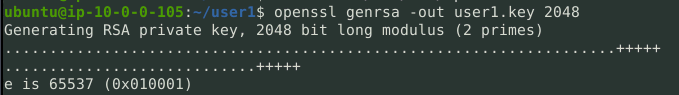

#### 3.2.2 Certificate Signing Request

Once we have a private key, we can use to to generate a CSR.

The `CN=user1` is common name and `O=devops` is the organisation.

```bash
openssl req -new -key user1.key -out user1.csr -subj "/CN=user1/O=devops"
```

This command does not have an output, so just check if the `user1.csr` file was created correctly.

#### 3.2.3 Generate Certificate

Once we have a certificate signing request, we can go ahead and generate a certificate for our user.

> Note: This command fails when executed without `sudo`.

```bash
sudo openssl x509 -req -in user1.csr -CA /etc/kubernetes/pki/ca.crt -CAkey /etc/kubernetes/pki/ca.key -CAcreateserial -out user1.crt -days 1000
```

#### 3.2.4 Generate `kubeconfig` for `user1`

Now that our user is ready with all the authentication required to work with Kubernetes, we need to create a kubeconfig file for the user which will set the context for the user to interact with the correct cluster.

```yaml
apiVersion: v1
clusters:
- cluster:
    certificate-authority: /etc/kubernetes/pki/ca.crt
    server: https://10.0.0.10:6443
  name: dev-cluster
- cluster:
    certificate-authority: /etc/kubernetes/pki/ca.crt
    server: https://10.0.0.10:6443
  name: qa-cluster
contexts:
- context:
    cluster: dev-cluster
    user: user1
  name: user1@dev-cluster
current-context: user1@dev-cluster
kind: Config
preferences: {}
users:
- name: user1
  user:
    client-certificate: /home/vagrant/certs/user1.crt
    client-key: /home/vagrant/certs/user1.key
```

First, we need to find out the context in which we are working and the name of our cluster.

```bash
kubectl config view
```

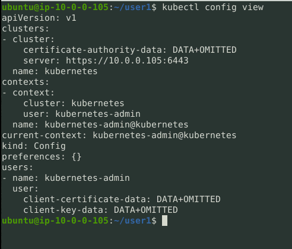

```bash
kubectl config --kubeconfig=user1.conf set-cluster kubernetes --server=https://10.0.0.105:6443 --certificate-authority=/etc/kubernetes/pki/ca.crt
```

Once the cluster is set, we need to set credentials

```bash
kubectl config --kubeconfig=user1.conf set-credentials user1 --client-certificate=$HOME/user1/user1.crt --client-key=$HOME/user1/user1.key
```

This should give an output like `User "user1" set.`

Once our user is set, we will add the context details

```bash
kubectl config --kubeconfig=user1.conf set-context dev --cluster=kubernetes --user=user1
```

The output should be `Context "dev" created.`

Finally, we have to actually use this context.

```bash
kubectl config --kubeconfig=user1.conf use-context dev
```

Here, the output will be `Switched to context "dev".`

This means our user is ready to get attached to a Role to allow interaction access.

### 3.3 Role & RoleBinding

Once our User is ready and in-context, we need to assign a Role to user. Implementing the **Principle of Least Privilege** is extremely essential in securing production and enterprise clusters, in other words, assigning roles ensures every user has only the permissions that are necessary for their function.

#### 3.3.1 Role

Our user is allowed to only interact with Pods, but in full capacity. Thus our permissions should include create, list, get, update and delete pods.

We will create this role using a YAML manifest.

```yaml
apiVersion: rbac.authorization.k8s.io/v1
kind: Role
metadata:
  name: pod-management-clusterrole
rules:
- apiGroups: ["*"]
  resources: ["pods"]
  verbs: ["get", "list", "delete", "create", "update"]
```

We need to apply this YAML file to create the role.

```bash
kubectl create -f podrole.yaml
```

Now, we will create the RoleBinding which will actually bind our user with this newly created role.

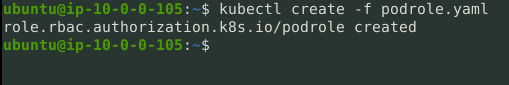

#### 3.3.2 RoleBinding

```yaml
apiVersion: rbac.authorization.k8s.io/v1
kind: RoleBinding
metadata:
  name: podrolebinding
subjects:
- kind: User
  name: user1 # name of your service account
roleRef: # referring to your Role
  kind: Role
  name: podrole
  apiGroup: rbac.authorization.k8s.io
```

Once again, we need to apply this file to create the resource.

```bash
kubectl create -f podrolebinding.yaml
```

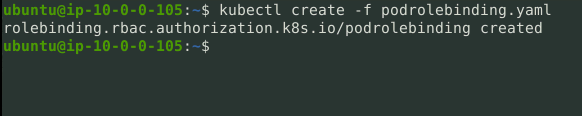

-------------------------

>  NOTE: The remaining part of the project has been completed on a GKE cluster because the t2/t3.micro (WE ARE ONLY ALLOWED THESE TWO TYPES IN THE LAB) cluster on AWS is unable to handle the workloads and keeps on failing. The ideas will remain the same regardless of the Cloud provider when you provision a 3 VM self-managed cluster.

----------------------------------------

## Step 4 Configure Application

We will use a simple Hello application from Google to create a deployment in our new cluster.

To create the Deployment, we will write a simple YAML manifest. Create a file named `hello-app.yaml`

```bash
nano hello-app.yaml
```

Write the following YAML script inside the file.

```yaml
apiVersion: apps/v1
kind: Deployment
metadata:
  name: hello-app
spec:
  replicas: 3
  selector:
    matchLabels:
      app: hello-app
  template:
    metadata:
      name: hello-app
      labels:
        app: hello-app
    spec:
      containers:
      - image: us-docker.pkg.dev/google-samples/containers/gke/hello-app:1.0
        name: hello-app
        ports:
          - containerPort: 8080
        resources:
            limits:
              cpu: "1m"
              memory: "1Mi"
```

Now let's create a Deployment using this file.

```bash
kubectl create -f hello-app.yaml
```

Once the deployment is created, we will verify it.

```bash
kubectl get deployment
```

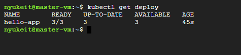

## Step 5 - ETCD Snapshot

ETCD is designed to tolerate failing VMs and automatically recovers from temporary failures. It can also withstand (N-1)/2 permanent failures. But any more failures than this is considered as a disastrous failure. In order to recover from such failures, it is a good practice to keep the ETCD backed-up.

### 5.1 Download & Install `etcdctl`

To take snapshots, we need `etcdctl` installed.

Check the latest version [here](https://github.com/etcd-io/etcd).

First, let's export the version to our environment.

```bash
export RELEASE="3.5.9"
```

Next, we download the executable with the saved version

```bash
wget https://github.com/etcd-io/etcd/releases/download/v${RELEASE}/etcd-v${RELEASE}-linux-amd64.tar.gz
```

We have to decompress the downloaded file and extract the contents.

```bash
tar xvf etcd-v${RELEASE}-linux-amd64.tar.gz
```

Finally, we move into the newly extracted folder and move the executable file to the local binary directory.

```bash
cd etcd-v${RELEASE}-linux-amd64
```

```bash
sudo mv etcdctl /usr/local/bin
```

Verify the installation

```bash
etcdctl version
```

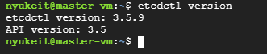

### 5.2 Take a Snapshot

To take the snapshot of the ETCD, we need to know the internal endpoint of the cluster. In case you are on a local cluster, this could be your VM IP. If you are using GKE, you can find this information by going into the details of the cluster.

We want to save the snapshot at `/tmp/myback`

```bash
sudo ETCDCTL_API=3 etcdctl --endpoints=10.128.0.2:2379 --cacert /etc/kubernetes/pki/etcd/ca.crt --cert /etc/kubernetes/pki/etcd/server.crt --key /etc/kubernetes/pki/etcd/server.key snapshot save /tmp/myback
```

Ideally, you would want to set up a CronJob to create frequent backups of the cluster.

## Step 6 - Auto Scaling

With Horizontal Pod AutoScaling, the idea is to increase the number of pods based on CPU utilisation. To balance the workload, if the CPU utilisation of the deployment goes above 50%, it will add another pod to reduce the load.

### 6.1 Metrics Server

In order for this to work, we first need the Kubernetes Metrics server to be installed. The metrics server will help Kubernetes collect performance and utilisation data in real time and thus make the decisions for autoscaling.

To install the metrics server

```bash
kubectl apply -f https://github.com/kubernetes-sigs/metrics-server/releases/latest/download/components.yaml
```

Once the metrics server is installed, you can verify it by checking a few metrics.

> Note: It may take a few minutes for the metrics to be live and available.

Since we are considering Pod metrics in this project, let's go ahead and check some pod metrics.

```bash
kubectl top pods
```

The output should be similar to this


### 6.2 Horizontal Pod AutoScaler

Once we have the metrics collection set up and working, we will deploy the HPA or Horizontal Pod AutoScaler. This K8s resource will be responsible for scaling the pods up or down based on resource utilisation.

Create a YAML file called `hello-hpa.yaml` and use the following code

```yaml
apiVersion: autoscaling/v2
kind: HorizontalPodAutoscaler
metadata:
  name: hpa-busybox
spec:
  maxReplicas: 5
  minReplicas: 1
  scaleTargetRef:
    apiVersion: apps/v1
    kind: Deployment
    name: hello-app
  metrics:
  - type: Resource
    resource:
      name: memory
      target:
        type: Utilization
        averageUtilization: 50
```

Here, the minReplicas is the number of replicas of the deployment that are available regardless of the utilisation and the maxReplicas is the number of replicas that the HPA can create.

## Step 7 - Deploy a Load Balancer

Finally, once we have everything in place, we will deploy a Load Balancer to forward traffic to our cluster. Once the cluster starts receiving more and more traffic, the workload on the containers will keep on increasing leading to the HPA to spring into action and create more replicas to handle the load.

There are a few ways to deploy a Load Balancer, but we will use the Kubernetes built-in LoadBalancer resource, that works with the Cloud Controller Manager.

> Note: Future versions of Kubernetes will deprecate the Cloud Controller Manager in favor of individual Cloud provider managed modules.

Once again, we will write a YAML file. Create a file named `hello-lb.yaml`.

```yaml
kind: Service
apiVersion: v1
metadata:
  name: hello-lb
spec:
  type: LoadBalancer
  selector:
    app: hello-app
  ports:
    - name: http
      port: 80
      targetPort: 8080
```

Now, we create the Load Balancer service.

```bash
kubectl create -f hello-lb.yaml
```

If the creation was successful, it should display a message like `service/hello-lb created`. To verify our new LB, we will use this command

```bash
kubectl get svc
```

As you will see, the External-IP might still be in a pending state. This is because the Cloud provider will actually provision a Public IP for this Load Balancer. This is managed by the Cloud Controller Manager we discussed of earlier.

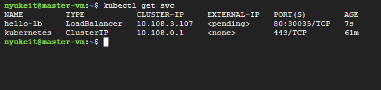

Check again in a few minutes and you should see an External IP assigned to the Load Balancer.

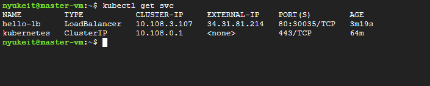

If you check on your cloud provider, the Load Balancer will be provisioned as well.

## Step 8 - App Deployed

Check the IP address of the Load Balancer. Type this address in your browser to check the app deployment.

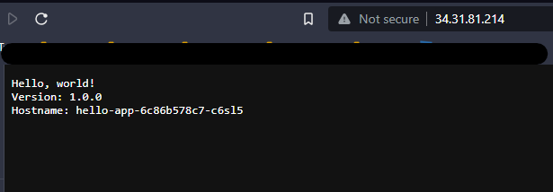

Now with the limits, the Horizontal Pod AutoScaler should be at work increasing the number of pods. Let's see this in action.

This is when the HPA is starting to kick-in. As we can see, currently there are only 3 active pods. The Replicas count is 0. Two of our containers are reaching their capped CPU limit. 

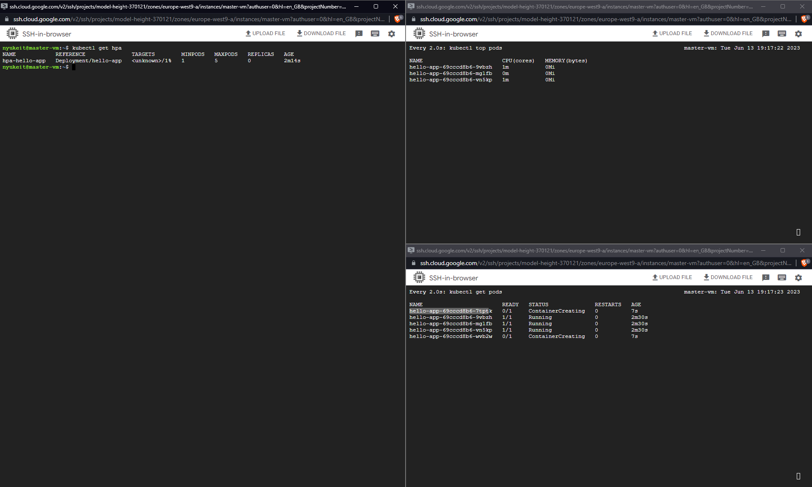

The HPA is creating additional pods here.

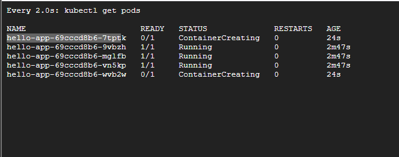

As we can see from the screenshot below, two of our containers reached our set resource limit of 1m CPU, which is why the HPA started created more pods.

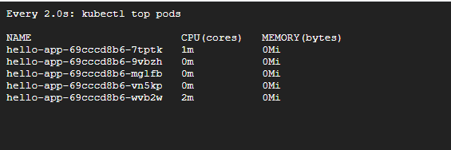

And finally, we can see that the HPA created 5 pods, as requested by us in the YAML file.

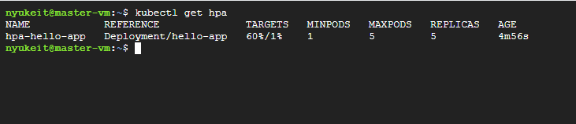
